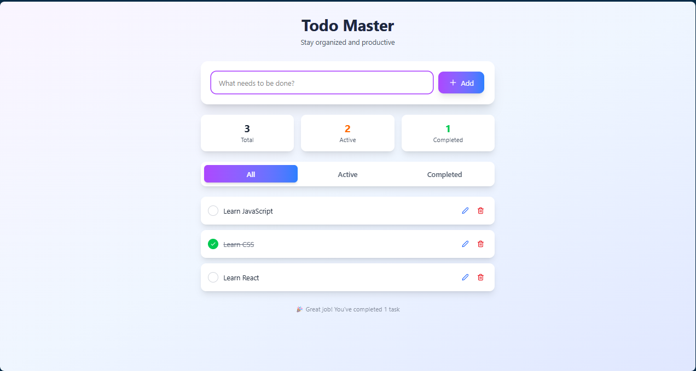

# Todo Master 📝

A beautiful, modern todo application built with React, TailwindCSS, and Lucide React icons. Stay organized and productive with an intuitive interface and smooth animations.



## ✨ Features

### Core Functionality
- **➕ Create Todo**: Add new tasks with a simple, elegant input form
- **✏️ Edit Todo**: Edit existing tasks inline with smooth transitions
- **✅ Mark as Completed**: Toggle completion status with visual feedback
- **🗑️ Delete Todo**: Remove tasks with beautiful slide-out animations
- **👀 View & Filter**: Filter todos by All, Active, or Completed status
- **💾 LocalStorage Ready**: Persistent storage capability (ready for implementation)

### User Experience
- **🎨 Modern UI Design**: Beautiful gradient backgrounds and clean interface
- **🎭 Smooth Animations**: Engaging hover effects, transitions, and micro-interactions
- **📊 Progress Tracking**: Real-time stats showing total, active, and completed tasks
- **📱 Responsive Design**: Works seamlessly across different screen sizes
- **🎯 Intuitive Navigation**: Easy-to-use filter system and clear visual hierarchy

## 🛠️ Tech Stack

- **Frontend Framework**: React 18+ with Hooks
- **Styling**: TailwindCSS for utility-first styling
- **Icons**: Lucide React for beautiful, consistent icons
- **State Management**: React useState and useEffect hooks
- **Animations**: CSS animations and Tailwind transitions

## 🚀 Getting Started

### Prerequisites

Make sure you have the following installed on your system:
- Node.js (version 14.0 or higher)
- npm or yarn package manager

### Installation Steps

1. **Clone the repository**
   ```bash
   git clone https://github.com/manishtmtmt/todo-master.git
   cd todo-master
   ```

2. **Install dependencies**
   ```bash
   npm install
   # or
   yarn install
   ```

3. **Install required packages**
   ```bash
   npm install lucide-react
   # or
   yarn add lucide-react
   ```

4. **Set up TailwindCSS**
   ```bash
   npm install tailwindcss @tailwindcss/vite
   ```

5. **Configure Tailwind** (vite.config.js)
   ```jsx
   import tailwindcss from "@tailwindcss/vite";
   import react from "@vitejs/plugin-react";
   import { defineConfig } from "vite";

   // https://vite.dev/config/
   export default defineConfig({
    plugins: [react(), tailwindcss()],
   });
   ```

6. **Add Tailwind directives** to your CSS file (src/index.css)
   ```css
   @import "tailwindcss";
   ```

### Running the Application

1. **Start the development server**
   ```bash
   npm start
   # or
   yarn start
   ```

2. **Open your browser** and navigate to `http://localhost:5173`

3. **Start organizing your tasks!** 🎉

### Building for Production

```bash
npm run build
# or
yarn build
```

## 🎯 Usage Guide

### Adding a Todo
1. Type your task in the input field
2. Click the "Add" button or press Enter
3. Watch your task appear with a smooth slide-in animation

### Managing Todos
- **Complete**: Click the circle button to mark as done
- **Edit**: Click the edit icon to modify the task text
- **Delete**: Click the trash icon to remove (with slide-out animation)

### Filtering
Use the filter buttons to view:
- **All**: Show all todos
- **Active**: Show only incomplete todos
- **Completed**: Show only finished todos

## 🎨 Customization

### Colors & Themes
The app uses a purple-to-blue gradient theme. You can customize colors in the component by modifying the Tailwind classes:

```jsx
// Primary gradient
className="bg-gradient-to-r from-purple-500 to-blue-500"

// Background gradient
className="bg-gradient-to-br from-purple-50 via-blue-50 to-indigo-100"
```

### Animations
All animations are CSS-based and can be customized in the `<style jsx>` section:

```css
@keyframes slide-in {
  from { opacity: 0; transform: translateX(-20px); }
  to { opacity: 1; transform: translateX(0); }
}
```

## 🔧 LocalStorage Implementation

To enable persistent storage, uncomment the localStorage code in the useEffect hooks:

```javascript
useEffect(() => {
  const savedTodos = localStorage.getItem('todos');
  if (savedTodos) {
    setTodos(JSON.parse(savedTodos));
  }
}, []);

useEffect(() => {
  localStorage.setItem('todos', JSON.stringify(todos));
}, [todos]);
```

## 📱 Browser Compatibility

- Chrome (recommended)
- Firefox
- Safari
- Edge

## 📋 Project Structure

```
todo-master/
├── src/
│   ├── App.js
│   ├── main.jsx
│   └── index.css
├── public/
├── package.json
└── README.md
```

## 🤝 Contributing

We welcome contributions! Here's how you can help:

1. Fork the repository
2. Create a feature branch (`git checkout -b feature/amazing-feature`)
3. Commit your changes (`git commit -m 'Add amazing feature'`)
4. Push to the branch (`git push origin feature/amazing-feature`)
5. Open a Pull Request

### Contribution Ideas
- [ ] Dark mode toggle
- [ ] Drag and drop reordering
- [ ] Task categories/tags
- [ ] Due dates and reminders
- [ ] Import/Export functionality
- [ ] Keyboard shortcuts

## 📄 License

This project is licensed under the MIT License - see the [LICENSE](LICENSE) file for details.

## 🙏 Acknowledgments

- **React Team** for the amazing framework
- **Tailwind Labs** for the utility-first CSS framework
- **Lucide** for the beautiful icon set
- **Open Source Community** for inspiration and best practices

---

## 🌟 Show Your Support

If you found this project helpful, please consider:
- ⭐ Starring the repository
- 🐛 Reporting bugs or issues
- 💡 Suggesting new features
- 📢 Sharing with others

## 📞 Contact & Support

- **GitHub Issues**: [Report bugs or request features](https://github.com/manishtmtmt/todo-master/issues)
- **Email**: manisht.mt.mt@gmail.com
- **LinkedIn**: [@wdmanisht](https://linkedin.com/in/wdmanisht)

---

## 📊 Rate This Project

**How would you rate Todo Master?**

⭐⭐⭐⭐⭐ **5 Stars** - Exceptional! Everything works perfectly  
⭐⭐⭐⭐☆ **4 Stars** - Great! Minor improvements needed  
⭐⭐⭐☆☆ **3 Stars** - Good! Some features could be better  
⭐⭐☆☆☆ **2 Stars** - Okay! Needs significant improvements  
⭐☆☆☆☆ **1 Star** - Poor! Major issues need fixing  

### 💬 Leave a Review

We'd love to hear your feedback! Please share:
- What you liked most about the app
- Any features you'd like to see added
- Suggestions for improvements
- Overall user experience rating

**Leave your review**: [GitHub Discussions](https://github.com/manishtmtmt/todo-master/discussions) or [Issues](https://github.com/manishtmtmt/todo-master/issues)

---

**Built with ❤️ by [Manish Tiwari]**

*Making productivity beautiful, one todo at a time* ✨
